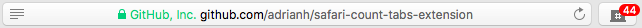
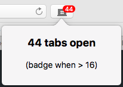
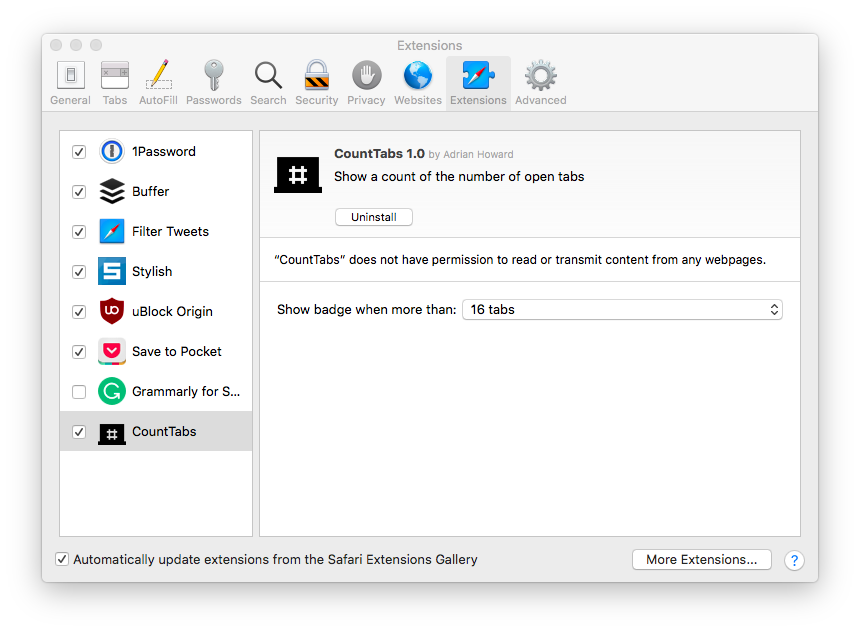

# Safari CountTabs extension

A simple way to stay aware of the number of open tabs in Safari.

By default you get a badge in the toolbar if you have more than sixteen tabs open.

You can click on the toolbar item to see a popup showing how many tabs are open and when the badge will be shown.

You can change when the badge is shown in the Safari Extension Preferences.

